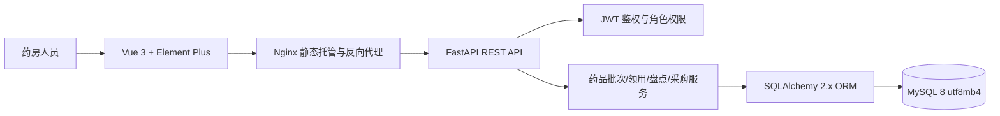
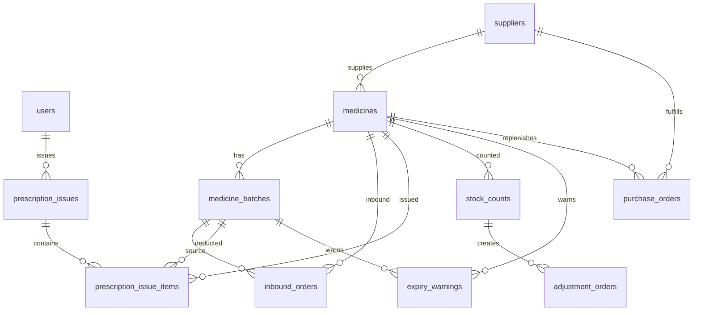

# 诊所药房药品批次与效期预警系统

让小型诊所药房把“到货入库、批次效期、处方领用、盘点差异、采购补货”纳入同一个可追踪的工作台。

## 🛠 技术栈
- Frontend: Vue 3 + Vite + Element Plus + Pinia + Axios + Zod
- Backend: Python FastAPI + SQLAlchemy 2.x + Pydantic + JWT
- Database: MySQL 8.0
- Infra: 单文件 Docker 启动 + Nginx

## 🚀 启动指南 (How to Run)
1. 进入 environment 目录。
2. 执行 `docker build -t item13-single:latest .`
3. 执行 `docker run --rm -p 3013:3013 -p 8013:8013 item13-single:latest`
4. 打开前端地址并使用测试账号登录。

## 🔗 服务地址 (Services)
- Frontend: http://localhost:3013
- Backend Swagger: http://localhost:8013/docs
- Backend Health: http://localhost:8013/health
- Database: 容器内 3306，不映射到宿主机

端口说明：前端固定 3013，后端固定 8013，数据库只在容器内 3306 监听。

## 🧪 测试账号
- Admin: admin / 123456
- 药房管理员: pharmacy / 123456
- 医生: doctor / 123456
- 采购员: buyer / 123456

首次启动后后端会自动校验 `admin` 账号：若不存在会创建，若密码、角色或状态不正确会修正为可用的系统管理员。

## 📷 功能介绍
- 药房看板：近效期批次数、库存周转率、今日领用金额、缺货药品数、采购待审数。
- 药品目录管理：维护药品编码、规格、分类、价格、安全库存、货位和供应商。
- 批次入库管理：登记到货药品批号、有效期、供应商和货位，真实写入 MySQL 并增加库存。
- 处方领用管理：按近效期优先扣减批次库存，同步更新药品总库存与领用金额。
- 效期预警管理：根据批次有效期和预警阈值生成风险列表。
- 库存盘点管理：录入实盘数量，自动生成调整单，管理员确认后更新库存。
- 采购补货管理：创建采购申请并完成审核，支撑缺货药品补货闭环。
- 供应商管理：维护配送渠道、联系人、电话、地址和供应范围。

## 🏗️ 系统架构


核心模块职责：
- 前端：登录、权限菜单、业务表格、表单校验、统一错误提示。
- 后端：统一响应体、业务校验、库存扣减、预警刷新、管理员账号自修复。
- 数据库：持久化药品目录、批次、入库、领用、盘点、调整、预警、采购、供应商和用户数据。

## 💾 数据设计


数据库配置由单个 Dockerfile 统一管理，MySQL 服务端、初始化脚本和应用连接均使用 `clinic_pharmacy` 数据库与 `utf8mb4` 字符集，确保中文数据不乱码。

## 🔌 接口说明
所有业务响应统一为：
```json
{"code": 200, "message": "操作成功", "data": {}}
```

主要接口：
- `POST /auth/login`：登录并返回 JWT。
- `GET /auth/me`：获取当前用户。
- `GET /api/dashboard`：药房看板指标。
- `GET/POST/PUT/DELETE /api/medicines`：药品目录管理。
- `GET /api/batches`：批次库存与效期列表。
- `GET/POST /api/inbounds`：批次入库。
- `GET/POST /api/prescriptions`：处方领用。
- `GET /api/warnings`：效期预警。
- `GET/POST /api/stock-counts`：库存盘点。
- `GET /api/adjustments`、`PUT /api/adjustments/{id}/approve`：调整单确认。
- `GET/POST /api/purchases`、`PUT /api/purchases/{id}/approve`：采购补货。
- `GET/POST/PUT/DELETE /api/suppliers`：供应商管理。

## 🌱 初始化数据说明
`init.sql` 会在 MySQL 容器首次初始化时自动执行，包含：
- 4 个测试用户角色：系统管理员、药房管理员、医生、采购员。
- 2 个供应商。
- 3 个药品目录。
- 3 个药品批次与对应入库单。
- 2 条处方领用记录。
- 2 条库存盘点记录、1 条待确认调整单。
- 2 条待审采购补货单。

如果需要重新执行初始化数据，可删除容器后重新启动。

## 📁 项目结构
```text
.
├── init.sql                  # MySQL 表结构与演示数据
├── backend/                  # FastAPI 后端
│   ├── app/api/              # 路由层
│   ├── app/core/             # 配置、日志、数据库、统一响应、安全工具
│   ├── app/services/         # 库存、预警、认证、看板业务逻辑
│   ├── app/models.py         # SQLAlchemy ORM 模型
│   └── app/schemas.py        # Pydantic DTO 校验
└── frontend/                 # Vue 3 前端
    ├── src/views/            # 登录页和业务页面
    ├── src/components/       # 页面头、状态标签、业务容器
    ├── src/api.js            # Axios 封装与统一错误提示
    └── src/router.js         # 路由守卫与角色菜单
```

## 🔧 Professional Engineering Practices
| 维度 | 已实现 |
| --- | --- |
| Docker 一键启动 | ✅ 单文件启动前端、后端和数据库 |
| 数据持久化 | ✅ 容器内 MySQL 初始化 |
| 中文编码 | ✅ MySQL 与连接统一 utf8mb4 |
| ORM 数据访问 | ✅ SQLAlchemy 2.x，无业务 SQL 字符串拼接 |
| 统一响应体 | ✅ `{code,message,data}` |
| 表单与接口校验 | ✅ 前端 Zod/Element Plus，后端 Pydantic |
| 错误处理 | ✅ 后端业务异常、前端 Toast 去重 |
| 日志系统 | ✅ Python logging 输出到容器 stdout |
| 权限控制 | ✅ 登录守卫、角色菜单、后端角色校验 |
| 响应式界面 | ✅ 登录页和后台页面适配桌面与移动端 |

已验证：
- `docker build -t item13-single:latest .` 构建通过。
- `docker run --rm -p 3013:3013 -p 8013:8013 item13-single:latest` 启动通过。
- `GET http://localhost:8013/health` 返回成功。
- `GET http://localhost:3013` 前端首页可访问。
